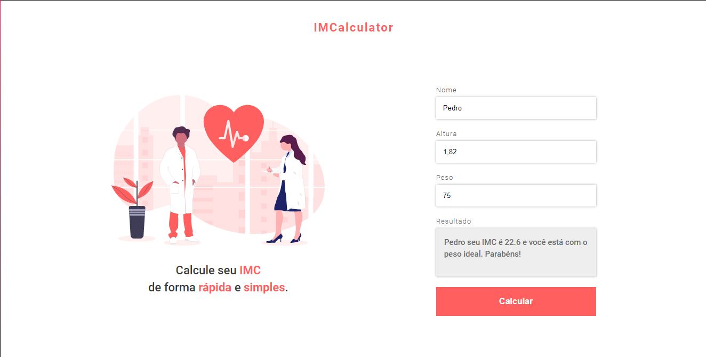

# IMCalculator

## Aplicação web para o calculo de IMC

Aplicação feita em ***HTML***, ***CSS*** e ***Javascript***, que calcula através da altura e peso da pessoa, o IMC (Índice de Massa Corporal) dela.
Este projeto serviu para praticar alguns conhecimentos adquiridos nos estudos de JavaScript, além do uso de forms em HTML.

-----------------------

### Capturas de tela dos layouts

>Layout no Desktop.

 

>Layout no Mobile.